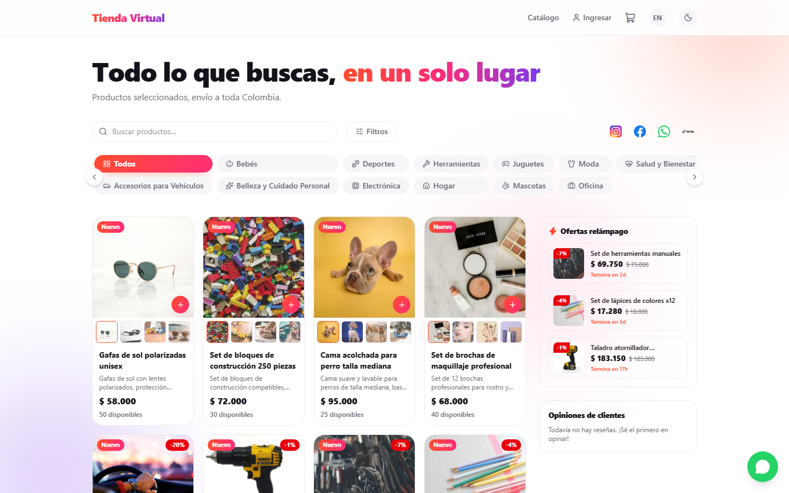
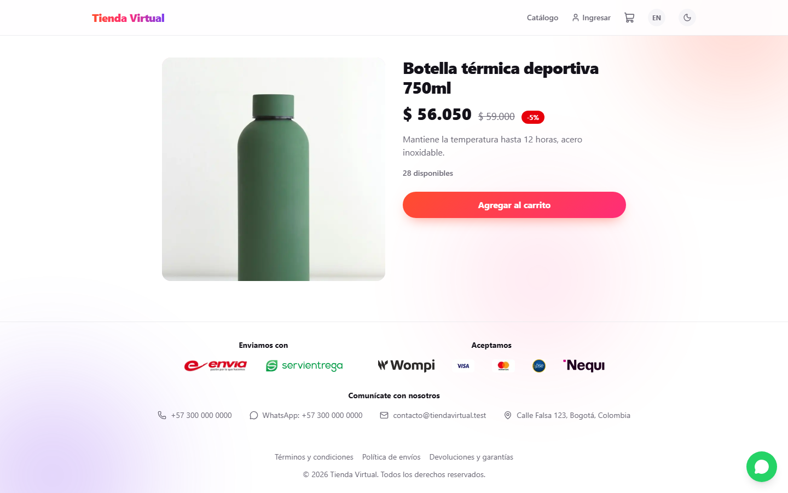
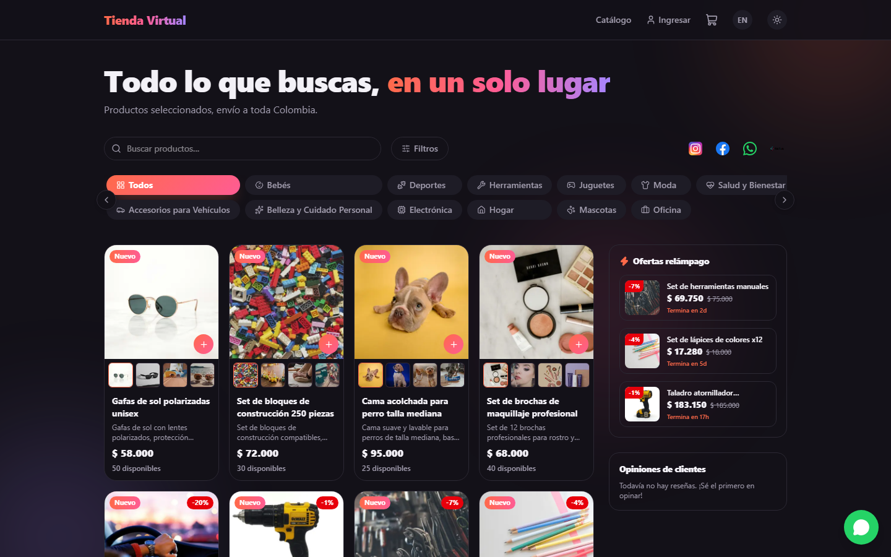
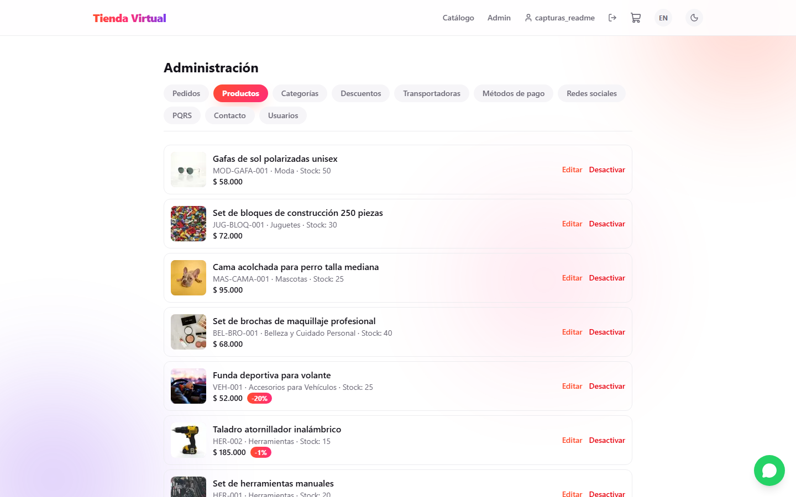
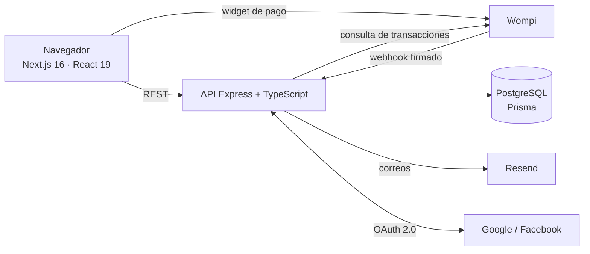

# Tienda Virtual — e-commerce colombiano

[](https://github.com/mulettcastillo2018/tienda-virtual/actions/workflows/ci.yml)

Tienda en línea completa para un comercio colombiano: catálogo, carrito, pagos con Wompi, descuentos con trazabilidad, posventa según la Ley 1480 (PQRS con área jurídica), panel de administración, bilingüe (ES/EN) y con modo oscuro.

> **Construido dirigiendo un agente de IA** (Claude Code). Yo definí el producto y las reglas del negocio, pedí un análisis técnico completo y decidí el orden de las correcciones; el agente escribió el código y las pruebas. Detalle en [Cómo se construyó con IA](#cómo-se-construyó-con-ia).



<table>
  <tr>
    <td align="center"><br><sub>Detalle de producto con descuento vigente</sub></td>
    <td align="center"><br><sub>Modo oscuro</sub></td>
  </tr>
  <tr>
    <td align="center" colspan="2"><br><sub>Panel de administración</sub></td>
  </tr>
</table>

## Qué hace

**Para el cliente**
- Catálogo con búsqueda, filtros por precio y marca, categorías con íconos y galería de 4 imágenes por producto.
- Carrito y checkout por pasos: dirección, resumen y pago con Wompi (tarjeta, PSE, Nequi).
- Plazo para pagar: si un pago se rechaza puede reintentar con otro medio; si no paga a tiempo, el pedido se cancela solo y los productos vuelven a su carrito.
- Ofertas relámpago, reseñas de la tienda (solo de compradores reales), inicio de sesión con Google o Facebook, recuperación de contraseña.
- PQRS (peticiones, quejas, reclamos y sugerencias) con plazo legal de 15 días hábiles, línea de tiempo y adjuntos privados.
- Español e inglés, modo claro y oscuro.

**Para la tienda**
- Productos, categorías, marcas, transportadoras, medios de pago, redes sociales e información de contacto administrables.
- Descuentos con duración: cada venta queda enlazada a la campaña de descuento que tenía, para poder explicar cualquier precio pasado.
- Pedidos con bitácora de estados, despacho con guía y marca de revisión para pagos que requieren reembolso.
- Área jurídica que responde las PQRS; el administrador solo lo hace si no hay nadie del área.

## Seguridad y calidad

Después de construir la tienda, se hizo un [análisis técnico y de negocio](docs/analisis-2026-09-28.pdf) con una hoja de ruta por fases. Ya están corregidas las fases 0 a 3:

| Fase | Qué se corrigió |
|---|---|
| 0 · Versionar | Todo el trabajo quedó en Git y en este repositorio. |
| 1 · Pagos | Webhook de Wompi idempotente y con validación de monto; un rechazo ya no cancela el pedido; vencimiento automático que libera el inventario; sincronización directa con la API de Wompi. |
| 2 · Cuentas | Sesiones revocables al instante (desactivar, cambiar rol o contraseña), límites de intentos, OAuth con `state` y sin vinculación automática de cuentas, correos escapados, cabeceras de seguridad. |
| 3 · Archivos | Tipo real de cada archivo por su contenido, adjuntos de PQRS privados con enlaces firmados, imágenes sin dominio fijo, integración continua. |

Las pruebas automáticas (94 comprobaciones) corren en cada cambio en GitHub Actions contra una base de datos nueva.

## Arquitectura



| Capa | Tecnologías |
|---|---|
| Frontend | Next.js 16 (App Router), React 19, TypeScript, Tailwind CSS v4, Zustand, i18n propio (ES/EN) |
| Backend | Node.js, Express, TypeScript, zod, Multer |
| Datos | PostgreSQL (Neon), Prisma ORM, 19 migraciones |
| Pagos y correo | Wompi (firma de integridad, webhooks, API), Resend |
| Seguridad | JWT con versión de sesión, bcrypt, OAuth 2.0, HMAC para enlaces firmados, límites de intentos |
| Calidad | Pruebas de extremo a extremo propias, GitHub Actions con PostgreSQL de servicio |

## Cómo se construyó con IA

**Reparto del trabajo**

| Yo (producto y dirección) | El agente de IA (Claude Code) |
|---|---|
| Definí la tienda y las reglas del negocio colombiano | Propuso la arquitectura y escribió el código |
| Pedí el análisis y decidí el orden de las correcciones | Hizo el análisis y ejecutó cada fase con sus pruebas |
| Contrasté con otra IA: una revisión externa encontró una condición de carrera en el inventario, que luego se corrigió y se probó con compras simultáneas | Escribió migraciones de datos y la integración continua |
| Exigí verificación y datos de prueba limpios | Resolvió los bloqueos del entorno corporativo |

**Decisiones de producto**
- Las PQRS las responde un **área jurídica**, no el administrador, con el plazo de la Ley 1480.
- **Trazabilidad de descuentos**: poder responder "por qué este producto se vendió más barato esa semana".
- Exactamente **4 imágenes por producto** (principal y 3 miniaturas) para un catálogo uniforme.
- Solo quien compró de verdad puede dejar una reseña, una por pedido.

**Cronología**: construcción del 24 al 26 de septiembre de 2026; el 28, análisis y fases 0 a 3 (ver el historial de commits).

## Correr en local

Requisitos: Node.js 20+, una base PostgreSQL (por ejemplo [Neon](https://neon.tech)), llaves de **sandbox** de [Wompi](https://comercios.wompi.co) y, opcionalmente, una API key de [Resend](https://resend.com).

```bash
# Backend (http://localhost:4000)
cd backend
cp .env.example .env         # DATABASE_URL, JWT_SECRET, llaves de Wompi, SEED_ADMIN_PASSWORD...
npm install
npx prisma migrate deploy
npx prisma db seed           # categorías, productos de ejemplo y el administrador inicial
npm run dev

# Frontend (http://localhost:3000)
cd frontend
cp .env.example .env.local   # NEXT_PUBLIC_API_URL=http://localhost:4000
npm install
npm run dev
```

**Tarjetas de prueba de Wompi (sandbox)**: aprobada `4242 4242 4242 4242`, rechazada `4111 1111 1111 1111`, con cualquier fecha futura y cualquier CVC.

En local, Wompi no puede enviar el webhook a `localhost`: la página de resultado del pago consulta la transacción directamente con la llave privada (`WOMPI_PRIVATE_KEY`).

¿Detrás de un proxy corporativo? Ver [docs/entorno-con-proxy.md](docs/entorno-con-proxy.md).

## Pruebas

```bash
cd backend
npm run test:e2e      # con el backend corriendo; crean y borran sus propios datos
npm run test:tipos    # tipos de las pruebas
npm run db:verificar  # el esquema coincide con la base
```

Suites: pagos con Wompi (webhooks firmados, rechazos, vencimiento, aprobación tardía, anulaciones), seguridad de las cuentas (sesiones, límites, OAuth, tokens manipulados), archivos subidos (tipo real, enlaces firmados, imágenes) y almacenamiento en la nube contra un S3 simulado.

## Publicar una demo

Todo está listo para publicarla gratis con Neon (base de datos), Render (API, con `render.yaml`), Vercel (frontend) y Cloudflare R2 (archivos, compatible con S3). Paso a paso en [docs/DESPLIEGUE.md](docs/DESPLIEGUE.md).

## Estado y siguientes pasos

- **Fase 3 (resto)**: crear las cuentas y publicar la demo siguiendo la guía de despliegue.
- **Fase 4**: estados de pedido completos (en preparación, entregado), validaciones de carrito, copia de la dirección en el pedido, paginación e índices, tablero de ventas.
- **Fase 5**: SEO (páginas renderizadas en el servidor, metadatos, sitemap), compra como invitado, pago contra entrega.
- **Fase 6**: autorización de datos (Ley 1581), identificación del comerciante y facturación electrónica.

---

### English summary

Complete Colombian e-commerce store: catalog, cart, Wompi payments with retries and automatic expiry, discount traceability, legally compliant after-sales (PQRS), admin panel, bilingual and dark mode. Built with Next.js, Express, PostgreSQL and Prisma by **directing an AI coding agent (Claude Code)**: I defined the product, requested a full technical audit and prioritized the fixes (idempotent payments, revocable sessions, secure OAuth, private signed file links); the agent implemented them with 94 automated checks running in CI.
